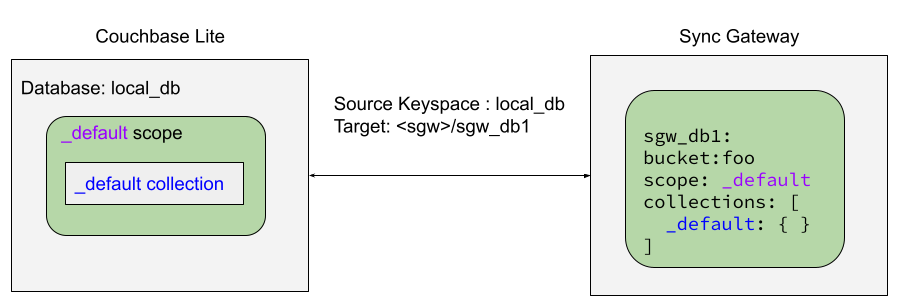
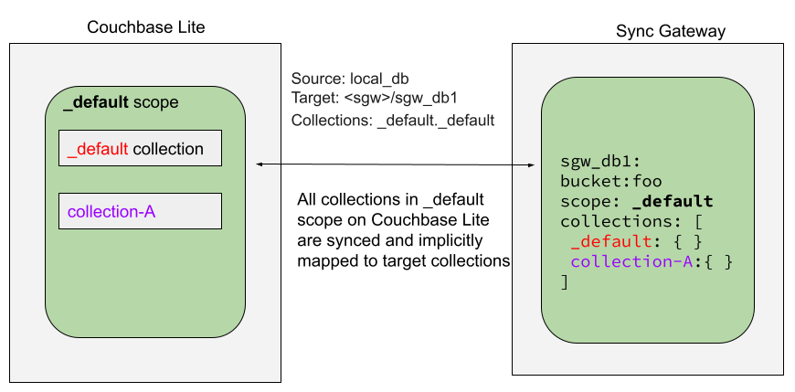
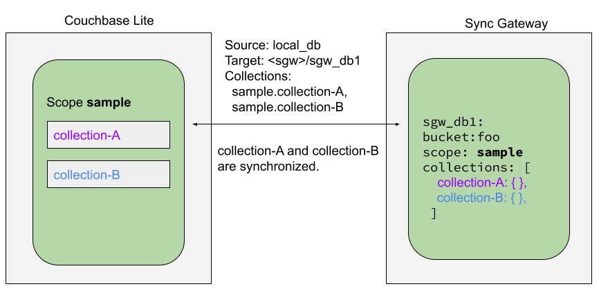
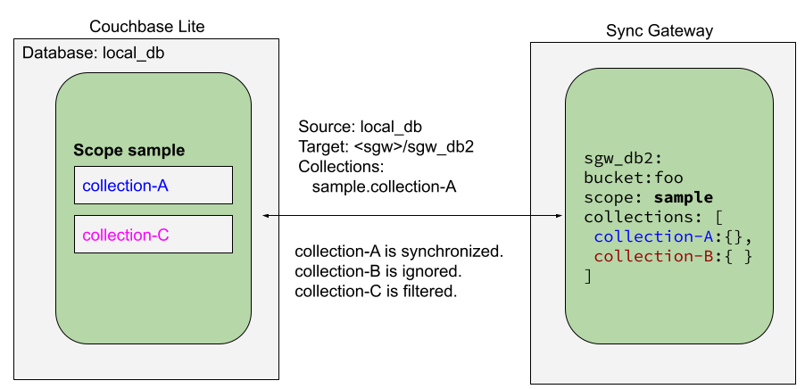
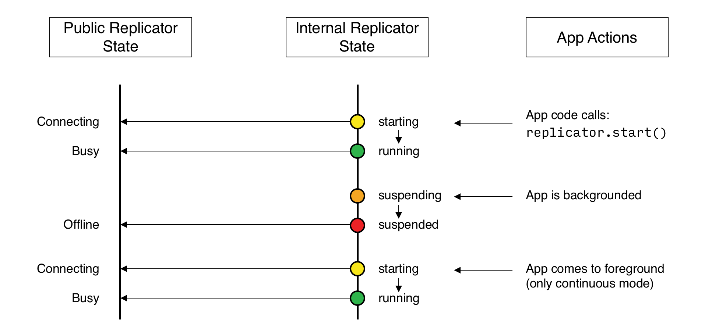

# Remote Sync Gateway 

> Description - _Couchbase Lite for Ionic — Synchronizing data changes between local and remote databases using Sync Gateway_

:::note
All code examples are indicative only. They demonstrate the basic concepts and approaches to using a feature. Use them as inspiration and adapt these examples to best practice when developing applications for your platform.
:::

## Introduction

Couchbase Lite for Ionic provides API support for secure, bi-directional, synchronization of data changes between mobile applications and a central server database. It does so by using a *replicator* to interact with Sync Gateway.

The *replicator* is designed to manage replication of documents and-or document changes between a source and a target database. For example, between a local Couchbase Lite database and remote Sync Gateway database, which is ultimately mapped to a bucket in a Couchbase Server instance in the cloud or on a server.

This page shows sample code and configuration examples covering the implementation of a replication using Sync Gateway.

Your application runs a replicator (also referred to here as a client), which will initiate connection with a Sync Gateway (also referred to here as a server) and participate in the replication of database changes to bring both local and remote databases into sync.

Subsequent sections provide additional details and examples for the main configuration options.

## Replication Concepts

Couchbase Lite allows for one database for each application running on the mobile device. This database can contain one or more scopes. Each scope can contain one or more collections.

To learn about Scopes and Collections, see [Databases](../databases.md).

You can set up a replication scheme across these data levels:

#### Database

    The `_default` collection is synced.

#### Collection

    A specific collection or a set of collections is synced.

As part of the syncing setup, the Gateway has to map the Couchbase Lite database to the database being synced on Capella.

## Replication Protocol

### Scheme

Couchbase Mobile uses a replication protocol based on WebSockets for replication. To use this protocol the replication URL should specify WebSockets as the URL scheme (see the [Configure Target](#configure-target) section below).

#### Incompatibilities

Couchbase Lite’s replication protocol is incompatible with CouchDB-based databases. And since Couchbase Lite 2.x+ only supports the new protocol, you will need to run a version of Sync Gateway that supports it — see: [Compatibility](../ProductNotes/compatibility.md).

### Ordering

To optimize for speed, the replication protocol doesn’t guarantee that documents will be received in a particular order. So we don’t recommend to rely on that when using the replication or database change listeners for example.

## Scopes and Collections

Scopes and Collections allow you to organize your documents in Couchbase Lite.

When syncing, you can configure the collections to be synced.

The collections specified in the Couchbase Lite replicator setup must exist (both scope and collection name must be identical) on the Sync Gateway side, otherwise starting the Couchbase Lite replicator will result in an error.

During replication:

    1. If Sync Gateway config (or server) is updated to remove a collection that is being synced, the client replicator will be offline and will be stopped after the first retry. An error will be reported.

    2. If Sync Gateway config is updated to add a collection to a scope that is being synchronized, the replication will ignore the collection. The added collection will not automatically sync until the Couchbase Lite replicator’s configuration is updated.

### Default Collection

When upgrading Couchbase Lite to 3.1, the existing documents in the database will be automatically migrated to the default collection.

For backward compatibility with the code prior to 3.1, when you set up the replicator with the database, the default collection will be set up to sync with the default collection on Sync Gateway.

#### Sync Couchbase Lite database with the default collection on Sync Gateway

<div align="center">



</div>

#### Sync Couchbase Lite default collection with default collection on Sync Gateway

<div align="center">



</div>

### User-Defined Collections

The user-defined collections specified in the Couchbase Lite replicator setup must exist (and be identical) on the Sync Gateway side to sync.

#### Syncing scope with user-defined collections.

<div align="center">



</div>

#### Syncing scope with user-defined collections. Couchbase Lite has more collections than the Sync Gateway configuration (with collection filters)

<div align="center">



</div>

## Configuration Summary

You should configure and initialize a replicator for each Couchbase Lite database instance you want to sync. [Example 1](#example-1-replication-configuration-and-initialization) shows the configuration and initialization process.

:::note
You need Couchbase Lite 3.1+ and Sync Gateway 3.1+ to use `custom` Scopes and Collections.
If you’re using Capella App Services or Sync Gateway releases that are older than version 3.1, you won’t be able to access `custom` Scopes and Collections. To use Couchbase Lite 3.1+ with these older versions, you can use the `default` Collection as a backup option.
:::

#### Example 1. Replication configuration and initialization

```typescript
//assumes you are running sync gateway locally, if you are 
 //running app services, replace enpoint with proper url and creditentials
 const target = new URLEndpoint('ws://localhost:4984/projects');
 const auth = new BasicAuthenticator('demo@example.com', 'P@ssw0rd12');
 const config = new ReplicatorConfiguration(target);
 config.addCollection(collectionName);
 config.setAuthenticator(auth);

 const replicator = await Replicator.create(config);

 //listen to the replicator change events
 const token = await replicator.addChangeListener((change) => {
	//check to see if there was an error
   	const error = change.status.getError();
  	if (error !== undefined) {
		//do something with the error
   	}
   	//get the status of the replicator using ReplicatorActivityLevel enum
  	if (change.status.getActivityLevel() ===  ReplicatorActivityLevel.IDLE) {
   		//do something because the replicator is now IDLE
   	}
 });

 // start the replicator without making a new checkpoint
 await replicator.start(false);

 //remember you must clean up the replicator when done with it by 
 //doing the following lines

 //await replicator.removeChangeListener(token);
 //await replicator.stop();
```

## Configure

##### In this section

[Configure Target](#configure-target) | [Sync Mode](#sync-mode) | [Retry Configuration](#retry-configuration) | [User Authorization](#user-authorization) | [Server Authentication](#server-authentication) | [Client Authentication](#client-authentication) | [Monitor Document Changes](#monitor-document-changes) | [Custom Headers](#custom-headers) | [Checkpoint Starts](#checkpoint-starts) | [Channels](#channels) | [Auto-purge on Channel Access Revocation](#auto-purge-on-channel-access-revocation) | [Delta Sync](#delta-sync)


### Configure Target

Use the Initialize and define the replication configuration with local and remote database locations using the ReplicatorConfiguration object.

The constructor provides:

    * the name of the local database to be sync’d
    * the server’s URL (including the port number and the name of the remote database to sync with)

    It is expected that the app will identify the IP address and URL and append the remote database name to the URL endpoint, producing for example: `wss://10.0.2.2:4984/travel-sample`
    The URL scheme for web socket URLs uses `ws:` (non-TLS) or `wss:` (SSL/TLS) prefixes.

#### Example 2. Add Target to Configuration

```typescript
// Define the target URL for the replication endpoint
const targetURL = 'wss://10.1.1.12:4984/travel-sample';

// Initialize the URLEndpoint with the target URL
const targetEndpoint = new URLEndpoint(targetURL);

// Create the ReplicatorConfiguration with the target endpoint
const config = new ReplicatorConfiguration(targetEndpoint);

// Add the already initialised collection to the replicator configuration
config.addCollection(collectionName);
```

:::note
Note use of the scheme prefix (`wss://` to ensure TLS encryption — strongly recommended in production — or `ws://`)
:::

### Sync Mode

Here we define the direction and type of replication we want to initiate.

We use `ReplicatorConfiguration` class’s `replicatorType` and `continuous` parameters, to tell the replicator:

    * The type (or direction) of the replication: `PUSH_AND_PULL`; `PULL`; `PUSH`
    * The replication mode, that is either of:
        * Continuous - remaining active indefinitely to replicate changed documents (`continuous=true`).
        * Ad-hoc - a one-shot replication of changed documents (`continuous=false`)

#### Example 4. Configure replicator type and mode

```typescript
config.replicatorType = ReplicatorType.PUSH_AND_PULL;

// Configure Sync Mode
config.continuous = true
```

:::tip
Unless there is a solid use-case not to, always initiate a single `PUSH_AND_PULL` replication rather than identical separate `PUSH` and `PULL` replications.

This prevents the replications generating the same checkpoint `docID` resulting in multiple conflicts.
:::

### Retry Configuration

Couchbase Lite for Ionic's replication retry logic assures a resilient connection.

Couchbase Lite for Swift’s replication retry logic assures a resilient connection.

In the event it detects a transient error, the replicator will attempt to reconnect, stopping only when the connection is re-established, or the number of retries exceeds the retry limit (9 times for a single-shot replication and unlimited for a continuous replication).

On each retry the interval between attempts is increased exponentially (exponential backoff) up to the maximum wait time limit (5 minutes).

The REST API provides configurable control over this replication retry logic using a set of configiurable properties — see: [Table 1](#table-1-replication-retry-configuration-properties).

#### Table 1. Replication Retry Configuration Properties

| Property               | Use cases                                     | Description                                                                                                                                                                                                                                                                                               |
|------------------------|-----------------------------------------------|-----------------------------------------------------------------------------------------------------------------------------------------------------------------------------------------------------------------------------------------------------------------------------------------------------------|
| `heartbeat()`          | Reduce to detect connection errors sooner <br/> <br/> Align to load-balancer or proxy `keep-alive` interval - see Sync Gateway’s topic [Load Balancer - Keep Alive](https://docs.couchbase.com/sync-gateway/current/load-balancer.html#websocket-connection) | The interval (in seconds) between the heartbeat pulses. <br/> <br/> Default: The replicator pings the Sync Gateway every 300 seconds.                                                                                                                                                                            |
| `maxAttempts()`        | Change this to limit or extend the number of retry attempts. | The maximum number of retry attempts. <br/> <br/> Set to zero (0) to use default values. <br/> <br/> Set to one (1) to prevent any retry attempt. <br/> <br/> The retry attempt count is reset when the replicator is able to connect and replicate. <br/> <br/> Default values are: <br/> - Single-shot replication = 9 <br/> - Continuous replication = maximum integer value. <br/> <br/> Negative values generate a Couchbase exception `InvalidArgumentException`. |
| `maxAttemptWaitTime()` | Change this to adjust the interval between retries. | The maximum interval between retry attempts. <br/> <br/> While you can configure the maximum permitted wait time, the replicator’s exponential backoff algorithm calculates each individual interval which is not configurable. <br/> <br/> Default value: 300 seconds (5 minutes). <br/> <br/> Zero sets the maximum interval between retries to the default of 300 seconds. <br/> <br/> 300 sets the maximum interval between retries to the default of 300 seconds. <br/> <br/> A negative value generates a Couchbase exception, `InvalidArgumentException`.    |

When necessary you can adjust any or all of those configurable values — see: [Example 5](#example-5-configuring-replication-retries) for how to do this.

#### Example 5. Configuring Replication Retries

```typescript
// Create the target endpoint
const target = new URLEndpoint('ws://foo.couchbase.com/db');

// Create the replicator configuration
const config = new ReplicatorConfiguration(target);

// Add the collection to the replicator configuration
config.addCollection(collection);

// Set the replicator type
config.setReplicatorType(ReplicatorType.PUSH_AND_PULL);

// Set continuous replication
config.setContinuous(true);

// Set heartbeat interval (in seconds)
config.setHeartbeat(150);

// Set the maximum number of retry attempts
config.setMaxAttempts(20);

// Set the maximum wait time between retry attempts (in seconds)
config.setMaxAttemptWaitTime(600);

// Create the replicator with the configuration
const replicator = await Replicator.create(config);
```

1. Here we use `setHeartbeat()` to set the required interval (in seconds) between the heartbeat pulses
2. Here we use `setMaxAttempts()` to set the required number of retry attempts
3. Here we use `setMaxAttemptWaitTime()` to set the required interval between retry attempts.

### User Authorization

By default, Sync Gateway does not enable user authorization. This makes it easier to get up and running with synchronization.

You can enable authorization in the sync gateway configuration file, as shown in [Example 6](#example-6-enable-authorization).

#### Example 6. Enable Authorization

```json
{
  "databases": {
    "mydatabase": {
      "users": {
        "GUEST": {"disabled": true}
      }
    }
  }
}
```
To authorize with Sync Gateway, an associated user must first be created. Sync Gateway users can be created through the [`POST /{tkn-db}/_user`](https://docs.couchbase.com/sync-gateway/current/rest-api-admin.html#/user/post__db___user_) endpoint on the Admin REST API.


### Server Authentication

Define the credentials your app (the client) is expecting to receive from the Sync Gateway (the server) in order to ensure it is prepared to continue with the sync.

Note that the client cannot authenticate the server if TLS is turned off. When TLS is enabled (Sync Gateway’s default) the client *must* authenticate the server. If the server cannot provide acceptable credentials then the connection will fail.

Use `ReplicatorConfiguration` property `acceptOnlySelfSignedServerCertificate` to tell the replicator how to verify server-supplied TLS server certificates.

    * If `acceptOnlySelfSignedServerCertificate` is `true` then any self-signed certificate is accepted. Certificates that are not self signed are rejected, no matter who signed them.
    * If `acceptOnlySelfSignedServerCertificate` is `false` (default), the client validates the server’s certificates against the system CA certificates. The server must supply a chain of certificates whose root is signed by one of the certificates in the system CA bundle.

#### Example 7. Set Server TLS security

##### CA Cert

Set the client to expect and accept only CA attested certificates.

```typescript
// Configure Server Security -- only accept CA Certs
config.acceptOnlySelfSignedServerCertificate = false
```

This is the default. Only certificate chains with roots signed by a trusted CA are allowed. Self signed certificates are not allowed.

##### Self Signed Cert

Set the client to expect and accept only self-signed certificates

```typescript
// Configure Server Security -- only accept self-signed certs
config.acceptOnlySelfSignedServerCertificate = true; 
```

Set this to true to accept any self signed cert. Any certificates that are not self-signed are rejected.

This all assumes that you have configured the Sync Gateway to provide the appropriate SSL certificates, and have included the appropriate certificate in your app bundle.

### Client Authentication

There are two ways to authenticate from a Couchbase Lite client: `Basic Authentication` or `Session Authentication`.

#### Basic Authentication

You can provide a user name and password to the basic authenticator class method. Under the hood, the replicator will send the credentials in the first request to retrieve a `SyncGatewaySession` cookie and use it for all subsequent requests during the replication. This is the recommended way of using basic authentication. [Example 8](#example-8-basic-authentication) shows how to initiate a one-shot replication as the user **username** with the password **password**.

#### Example 8. Basic Authentication

```typescript
const url = "ws://localhost:4984/mydatabase";
const target = new URLEndpoint(url);
const auth = new BasicAuthenticator("john", "pass"); 
const config = new ReplicatorConfiguration(target);

// Assuming collection is already defined and initialized
config.addCollection(collectionName);
config.setAuthenticator(auth);

const replicator = new Replicator(config);
await replicator.start();
```

#### Session Authentication

Session authentication is another way to authenticate with Sync Gateway.

A user session must first be created through the [`POST /{tkn-db}/_session`](https://docs.couchbase.com/sync-gateway/current/rest-api.html#/session/post__db___session) endpoint on the Public REST API.

The HTTP response contains a session ID which can then be used to authenticate as the user it was created for.

See [Example 9](#example-9-session-authentication), which shows how to initiate a one-shot replication with the session ID returned from the `POST /{tkn-db}/_session` endpoint.

#### Example 9. Session Authentication

```typescript
const url = new URL("ws://localhost:4984/mydatabase");
const target = new URLEndpoint(url);
const config = new ReplicatorConfiguration(target);
const sessionID = 'your-session-id';
const cookieName = 'your-cookie-name';

// Assuming collection is already defined and initialized
config.addCollection(collectionName);

// Here cookieName is optional, if not passed it will default to the default value
const sessionAuthenticator = new SessionAuthenticator(sessionID, cookieName);
config.setAuthenticator(sessionAuthenticator);

let replicator = new Replicator(config);
await replicator.start();
```

### Custom Headers

Custom headers can be set on the configuration object. The replicator will then include those headers in every request.

This feature is useful in passing additional credentials, perhaps when an authentication or authorization step is being done by a proxy server (between Couchbase Lite and Sync Gateway) — see [Example 10](#example-10-setting-custom-headers).

#### Example 10. Setting custom headers

```typescript
const config = new ReplicatorConfiguration(target);
config.addCollection(collection);

// Setting headers
config.setHeaders({ "CustomHeaderName": "Value" });
```

### Channels

By default, Couchbase Lite gets all the channels to which the configured user account has access.

This behavior is suitable for most apps that rely on `user authentication` and the `sync function` to specify which data to pull for each user.

Optionally, it’s also possible to specify a string array of channel names on Couchbase Lite’s replicator configuration object by passing in a CollectionConfiguration object when adding in a collection.

```typescript
const config = new ReplicatorConfiguration(target);
const collectionConfig = new CollectionConfiguration();
collectionConfig.setChannels(['channel1', 'channel2']);
config.addCollection(collection, collectionConfig);
```
In this case, the replication from Sync Gateway will only pull documents tagged with those channels.  

:::caution
Push replicator will ignore this filter.
:::

### Documents

By default, Couchbase Lite will replicate all documents that belong to the channels specified in the collection configuration.  However, you can override this behavior by `filtering`  the documents using the `CollectionConfiguration` object.

```typescript
const config = new ReplicatorConfiguration(target);
const collectionConfig = new CollectionConfiguration();
collectionConfig.setDocumentIDs(['doc1', 'doc2', 'doc3']);
config.addCollection(collection, collectionConfig);
```

### Auto-purge on Channel Access Revocation

:::caution
This is a Breaking Change at 3.0
:::

#### New outcome

By default, when a user loses access to a channel all documents in the channel (that do not also belong to any of the user’s other channels) are auto-purged from the local database (in devices belonging to the user).

#### Prior outcome

*Previously these documents remained in the local database*

Prior to this release, CBL auto-purged only in the case when the user loses access to a document by removing the doc from all of the channels belong to the user. Now, in addition to 2.x auto purge, Couchbase Lite will also auto-purges the docs when the user loses access to the doc via channel access revocation. This feature is enabled by default, but an opt-out is available.

#### Behaviour

Users may lose access to channels in a number of ways:

    * User loses direct access to channel
    * User is removed from a role
    * A channel is removed from a role the user is assigned to

By default, when a user loses access to a channel, the next Couchbase Lite Pull replication auto-purges all documents in the channel from local Couchbase Lite databases (on devices belonging to the user) unless they belong to any of the user’s other channels — see: [Table 2](#table-2-behavior-following-access-revocation).

Documents that exist in multiple channels belonging to the user (even if they are not actively replicating that channel) are not auto-purged unless the user loses access to all channels.

Users will be receive an `AccessRemoved` notification from the DocumentListener if they lose document access due to channel access revocation; this is sent regardless of the current auto-purge setting.

#### Table 2. Behavior following access revocation

|  |       System State	                        |       Impact on Sync        |
|----------------------|------------------------------------------------------------------|-------------------------------------------------------------------|
| **Replication Type** | **Access Control on Sync Gateway**                               | **Expected behavior when** *enable_auto_purge=true*               |
| **Pull only**        | User revoked access to channel.                                  | Previously synced documents are auto purged on local              |
|                      | Sync Function includes `requireAccess(revokedChannel)`           |                                                                   |
| **Push only**        | User revoked access to channel.                                  | No impact of auto-purge                                           |
|                      | Sync Function includes `requireAccess(revokedChannel)`           | Documents get pushed but are rejected by Sync Gateway             |
| **Push-pull**        | User revoked access to channel                                   | Previously synced documents are auto purged on Couchbase Lite.    |
|                      | Sync Function includes `requireAccess(revokedChannel)`           | Local changes continue to be pushed to remote but are rejected by Sync Gateway |


If a user subsequently regains access to a lost channel, then any previously auto-purged documents still assigned to any of their channels are automatically pulled down by the active Sync Gateway when they are next updated — see behavior summary in [Table 3](#table-3-behavior-if-access-is-regained).

#### Table 3. Behavior if access is regained

|  |       System State	                        |       Impact on Sync        |
|----------------------|-----------------------------------------------------------------------------|--------------------------------------------------------------------------------------------------------------------------------------------------------------|
| **Replication Type** | **Access Control on Sync Gateway**                                          | **Expected behavior when enable_auto_purge=true**                                                                                                             |
| **Pull only**        | User REASSIGNED access to channel                                           | Previously purged documents that are still in the channel are automatically pulled by Couchbase Lite when they are next updated                               |
| **Push only**        | User REASSIGNED access to channel                                           | Local changes previously rejected by Sync Gateway will not be automatically pushed to remote unless resetCheckpoint is involved on CBL. Document changes subsequent to the channel reassignment will be pushed up as usual. |
|                      | Sync Function includes `requireAccess(reassignedChannel)` No impact of auto-purge |                                                                                                                                                              |
| **Push-pull**        | User REASSIGNED access to channel                                           | Previously purged documents are automatically pulled by Couchbase Lite                                                                                       |
|                      | Sync Function includes `requireAccess(reassignedChannel)`                   | Local changes previously rejected by Sync Gateway will not be automatically pushed to remote unless resetCheckpoint is involved. Document changes subsequent to the channel reassignment will be pushed up as usual. |


#### Config

Auto-purge behavior is controlled primarily by the ReplicationConfiguration option `enableAutoPurge`. Changing the state of this will impact only future replications; the replicator will not attempt to sync revisions that were auto purged on channel access removal. Clients wishing to sync previously removed documents must use the resetCheckpoint API to resync from the start.

#### Example 11. Setting auto-purge

```typescript
// set auto-purge behavior (here we override default)
config.enableAutoPurge = false;
```

Here we have opted to turn off the auto purge behavior. By default auto purge is enabled.

### Delta Sync

:::important
This is an [Enterprise Edition](https://www.couchbase.com/products/editions/) feature.
:::

With Delta Sync, only the changed parts of a Couchbase document are replicated. This can result in significant savings in bandwidth consumption as well as throughput improvements, especially when network bandwidth is typically constrained.

Replications to a Server (for example, a Sync Gateway, or passive listener) automatically use delta sync if the property is enabled at database level by the server — see: [databases.$db.delta_sync.enabled](https://docs.couchbase.com/sync-gateway/current/configuration-properties-legacy.html#databases-foo_db-delta_sync).

Intra-Device replications automatically disable delta sync, whilst Peer-to-Peer replications automatically enable delta sync.

## Initialize

##### In this section

[Start Replicator](#start-replicator) | [Checkpoint Starts](#checkpoint-starts)

### Start Replicator

Use the `Replicator.create()` method to initialize the replicator with the configuration you have defined. You can optionally add a change listener (see [Monitor](#monitor)) before starting the replicator using `start()`.

#### Example 12. Initialize and run replicator

```typescript
// Apply configuration settings to the replicator
const replicator = await Replicator.create(config);

// start the replicator without making a new checkpoint
await replicator.start(false);
```

### Checkpoint Starts

Replicators use `checkpoints` to keep track of documents sent to the target database.

Without `checkpoints`, Couchbase Lite would replicate the entire database content to the target database on each connection, even though previous replications may already have replicated some or all of that content.

This functionality is generally not a concern to application developers. However, if you do want to force the replication to start again from zero, use the `checkpoint` reset argument when starting the replicator — as shown in Example 13.

#### Example 13. Resetting checkpoints

```typescript
if (doResetCheckpointRequired) {
    this.replicator.start(true);
} else {
    this.replicator.start(false);
}
```
The default `false` is shown here for completeness only; it is unlikely you would explicitly use it in practice.


## Monitor

##### In this section

    [Change Listeners](#change-listeners) | [Replicator Status](#replicator-status) | [Monitor Document Changes](#monitor-document-changes) | [Documents Pending Push](#documents-pending-push)

You can monitor a replication’s status by using a combination of `Change Listeners` and the `Replicator.getStatus()` property. This enables you to know, for example, when the replication is actively transferring data and when it has stopped.

You can also choose to monitor document changes — see: [Monitor Document Changes](#monitor-document-changes).

### Change Listeners

Use this to monitor changes and to inform on sync progress; this is an optional step. You can add and a replicator change listener at any point; it will report changes from the point it is registered.

:::tip
Don’t forget to save the token so you can remove the listener later
:::

Use the `Replicator` class to add a change listener as a callback to the Replicator (`addChangeListener()`) — see: [Example 14](#example-14-monitor-replication). You will then be asynchronously notified of state changes.

You can remove a change listener with `removeChangeListener(token)`.

### Replicator Status

You can use the `Replicator.getStatus()` property to check the replicator status. That is, whether it is actively transferring data or if it has stopped — see: [Example 14](#example-14-monitor-replication).

The returned *ReplicationStatus* structure comprises:

* `ActivityLevel` — stopped, offline, connecting, idle or busy — see states described in: [Table 5](#table-5-replicator-activity-levels)

* `Progress`
    * completed — the total number of changes completed
    * total — the total number of changes to be processed

* `Error` - the current error, if any.

#### Example 14. Monitor replication

```typescript
// Optionally add a change listener
// Retain token for use in deletion
const token = replicator.addChangeListener((change) => {
    if (change.status.getActivityLevel() === 'STOPPED') {
        console.log("Replication stopped");
    } else {
        console.log(`Replicator is currently : ${change.status.getActivityLevel()}`);
    }
});
```

### Replication States

[Table 5](#table-5-replicator-activity-levels) shows the different states, or activity levels, reported in the API; and the meaning of each.

#### Table 5. Replicator activity levels

| **State** | **Meaning**                               |
|----------------------|------------------------------------------------------------------|
| `STOPPED`       | The replication is finished or hit a fatal error.                                 |
| `OFFLINE`        | The replicator is offline as the remote host is unreachable                                  |
| `CONNECTING`                    | The replicator is connecting to the remote host           |
| `IDLE`                    | The replication caught up with all the changes available from the server. The `IDLE` state is only used in continuous replications.           |
| `BUSY`        | The replication is actively transferring data. |

### Replication Status and App Life Cycle

The following diagram describes the status changes when the application starts a replication, and when the application is being backgrounded or foregrounded by the OS. It applies to iOS only.



Additionally, on iOS, an app already in the background may be terminated. In this case, the `Database` and `Replicator` instances will be `null` when the app returns to the foreground. Therefore, as preventive measure, it is recommended to do a `null` check when the app enters the foreground, and to re-initialize the database and replicator if any of those is `null`.

On other platforms, Couchbase Lite doesn’t react to OS backgrounding or foregrounding events and replication(s) will continue running as long as the remote system does not terminate the connection and the app does not terminate. It is generally recommended to stop replications before going into the background otherwise socket connections may be closed by the OS and this may interfere with the replication process.

### Monitor Document Changes

You can choose to register for document updates during a replication.

For example, the code snippet in [Example 15](#example-15-register-a-document-listener) registers a listener to monitor document replication performed by the replicator referenced by the variable `replicator`. It prints the document ID of each document received and sent. Stop the listener as shown in [Example 16](#example-16-stop-document-listener).

#### Example 15. Register a document listener

```typescript
const token = await replicator.addDocumentChangeListener((replication) => {
    console.log(`Replication type :: ${replication.isPush ? "Push" : "Pull"}`);
    for (const document of replication.documents) {
        if (document.error === undefined) {
            console.log(`Doc ID :: ${document.id}`);
            if (document.flags.includes('DELETED')) {
                console.log("Successfully replicated a deleted document");
            }
        } else {
            console.error("Error replicating document:", document.error);
        }
    }
});

// Start the replicator without resetting the checkpoint
await replicator.start(false);
```

#### Example 16. Stop document listener

This code snippet shows how to stop the document listener using the token from the previous example.

```typescript
await this.replicator.removeChangeListener(token);
```

### Document Access Removal Behavior

When access to a document is removed on Sync Gateway (see: Sync Gateway’s [Sync Function](https://docs.couchbase.com/sync-gateway/current/sync-function-api.html)), the document replication listener sends a notification with the `AccessRemoved` flag set to `true` and subsequently purges the document from the database.

## Documents Pending Push

:::tip
`Replicator.isDocumentPending()` is quicker and more efficient. Use it in preference to returning a list of pending document IDs, where possible.
:::

You can check whether documents are waiting to be pushed in any forthcoming sync by using either of the following API methods:

* Use the `Replicator.pendingDocumentIds()` method, which returns a list of document IDs that have local changes, but which have not yet been pushed to the server.
* Use the `Replicator.isDocumentPending()` method to quickly check whether an individual document is pending a push.

#### Example 17. Use Pending Document ID API

```typescript
// Todo 
```

## Stop

Stopping a replication is straightforward. It is done using `stop()`. This initiates an asynchronous operation and so is not necessarily immediate. Your app should account for this potential delay before attempting any subsequent operations.

You can find further information on database operations in [Databases](../databases.md).

#### Example 18. Stop replicator

```typescript
// Remove the change listener
await this.replicator.removeChangeListener(token)

// Stop the replicator
await this.replicator.stop()
```

Here we initiate the stopping of the replication using the `stop()` method. It will stop any active `change listener` once the replication is stopped.

## Error Handling

When *replicator* detects a network error it updates its status depending on the error type (permanent or temporary) and returns an appropriate HTTP error code. 

The following code snippet adds a `Change Listener`, which monitors a replication for errors and logs the the returned error code.

#### Example 19. Monitoring for network errors

```typescript
replicator.addChangeListener((change) => {
    const error = change.status.getError();
    if (error) {
        console.log(`Error code :: ${error.code}`);
    }
});
```

**For permanent network errors** (for example, `404` not found, or `401` unauthorized): *Replicator* will stop permanently, whether `setContinuous` is *true* or *false*. Of course, it sets its status to `STOPPED`

**For recoverable or temporary errors:** *Replicator* sets its status to `OFFLINE`, then:

    * If `setContinuous=true` it retries the connection indefinitely
    * If `setContinuous=false` (one-shot) it retries the connection a limited number of times.

The following error codes are considered temporary by the Couchbase Lite replicator and thus will trigger a connection retry.

    * `408`: Request Timeout
    * `429`: Too Many Requests
    * `500`: Internal Server Error
    * `502`: Bad Gateway
    * `503`: Service Unavailable
    * `504`: Gateway Timeout
    * `1001`: DNS resolution error

## Load Balancers

Couchbase Lite uses WebSockets as the communication protocol to transmit data. Some load balancers are not configured for WebSocket connections by default (NGINX for example); so it might be necessary to explicitly enable them in the load balancer’s configuration (see [Load Balancers](https://docs.couchbase.com/sync-gateway/current/load-balancer.html)).

By default, the WebSocket protocol uses compression to optimize for speed and bandwidth utilization. The level of compression is set on Sync Gateway and can be tuned in the configuration file ([replicator_compression](https://docs.couchbase.com/sync-gateway/current/configuration-properties-legacy.html#replicator_compression)).

## Troubleshooting

### Logs

As always, when there is a problem with replication, logging is your friend. You can increase the log output for activity related to replication with Sync Gateway — see [Example 21](#example-21-set-logging-verbosity).

#### Example 21. Set logging verbosity


```typescript
// Verbose / Replicator
database.setLogLevel(LogDomain.REPLICATOR, Loglevel.VERBOSE);

// Verbose / Network
database.setLogLevel(LogDomain.NETWORK, Loglevel.VERBOSE);
```

For more on troubleshooting with logs, see: [Using Logs](../Troubleshooting/using-logs.md).

### Authentication Errors

If Sync Gateway is configured with a self signed certificate but your app points to a `ws` scheme instead of `wss` you will encounter an error with status code 11006 — see: [Example 22](#example-22-protocol-mismatch)

#### Example 22. Protocol Mismatch

```console
CouchbaseLite Replicator ERROR: {Repl#2} Got LiteCore error: WebSocket error 1006 "connection closed abnormally"
```

If Sync Gateway is configured with a self signed certificate, and your app points to a `wss` scheme but the replicator configuration isn’t using the certificate you will encounter an error with status code `5011` — see: [Example 23](#example-23-certificate-mismatch-or-not-found)

#### Example 23. Certificate Mismatch or Not Found

```console
CouchbaseLite Replicator ERROR: {Repl#2} Got LiteCore error: Network error 11 "server TLS certificate is self-signed or has unknown root cert"
```