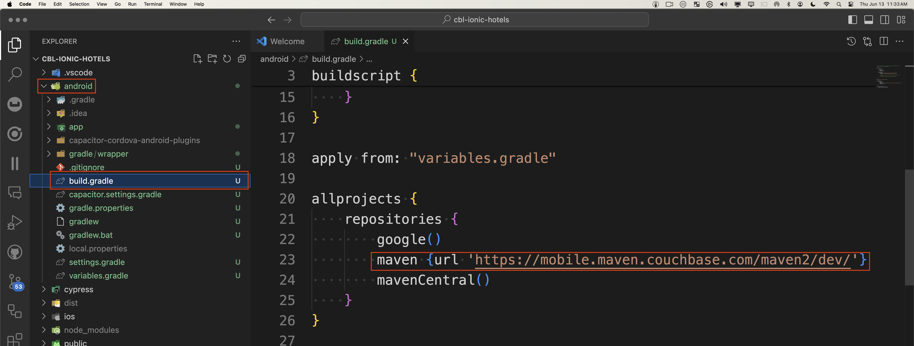

# Install

## Get Started

To get started coding Couchbase Lite for Ionic Capacitor apps, you will need to download the assets for the Ionic Plugin repo and build the plugin.

### How to install the cbl-ionic Plugin

1. The cbl-ionic plugin is available on npm.  You can install it by running the following command:
```shell
npm install cbl-ionic
```

### iOS - Validate Cocoa Pod Installation

The `npm install` should add the plugin to your project and install the CocoaPods for iOS.  You can validate the CocoaPods installation by reviewing the `Podfile` the ios\App folder of your Ionic project.  The file should look something like this:

```ruby
require_relative '../../node_modules/@capacitor/ios/scripts/pods_helpers'

platform :ios, '13.0'
use_frameworks!

# workaround to avoid Xcode caching of Pods that requires
# Product -> Clean Build Folder after new Cordova plugins installed
# Requires CocoaPods 1.6 or newer
install! 'cocoapods', :disable_input_output_paths => true

def capacitor_pods
  pod 'Capacitor', :path => '../../node_modules/@capacitor/ios'
  pod 'CapacitorCordova', :path => '../../node_modules/@capacitor/ios'
  pod 'CapacitorApp', :path => '../../node_modules/@capacitor/app'
  pod 'CapacitorHaptics', :path => '../../node_modules/@capacitor/haptics'
  pod 'CapacitorKeyboard', :path => '../../node_modules/@capacitor/keyboard'
  pod 'CapacitorStatusBar', :path => '../../node_modules/@capacitor/status-bar'
  pod 'CblIonic', :path => '../../node_modules/cbl-ionic'
end

target 'App' do
  capacitor_pods
  # Add your Pods here
end

post_install do |installer|
  assertDeploymentTarget(installer)
end

```

:::note
Note that the plugin requires iOS 13.0 or higher.  You must update any existing iOS projects to use iOS 13.0 or higher.
:::

Once you validated the CocoaPods installation, you must do a `pod install` from the ios\App folder to install the CocoaPods into your iOS project before your app will build to add the CocoaPod to your project.

```shell 
cd ios/App
pod install
cd ../..
```

### Android - Update the `all projects` gradle file 

In Android, you need to update the main build.gradle file found at the root of your Android folder of the application to include the URL to find Couchbase Lite for Android.  The following is an example of the build.gradle file:

```gradle
allprojects {
    repositories {
        google()
        maven {url 'https://mobile.maven.couchbase.com/maven2/dev/'}
        mavenCentral()
    }
}
```


In this example, the maven url was added that points to the maven server that hosts the Couchbase Lite Android packages.

### Run Capacitor Sync

After making plugin changes, it never hurts to run a sync to make sure everything is working correctly.

```powershell
npx cap sync 
```

### Build your app
You can now use the standard build and run commands that ionic capacitor offers to run your app from the main directory of your app.

```shell
npm run build
```
### Live Reload

To use the live reload feature of ionic capacitor, you can use the following commands:

**iOS**:
```shell
ionic capacitor run ios --livereload external
```

**Android**:
```shell
ionic capacitor run android --livereload external
```

### Run your app in Native IDEs
You can run your apps in the Native IDEs (XCode and Android Studio) by using the following commands:

**iOS**:
```shell
npx cap sync ios 
npx cap open ios
```

**Android**:
```shell
npx cap sync android
npx cap open android 
```

